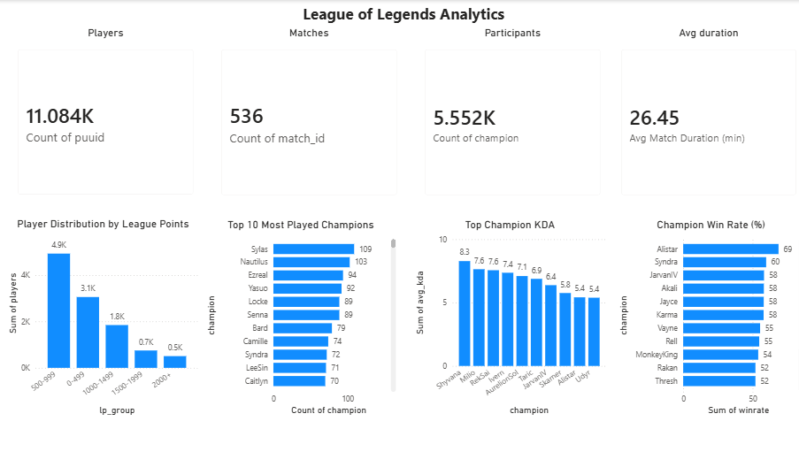
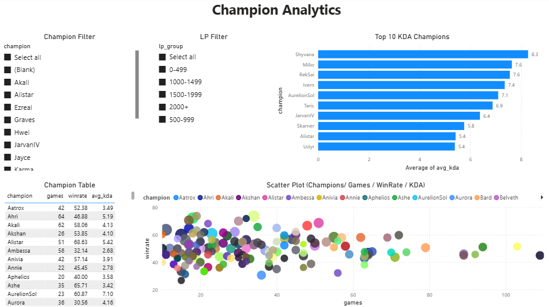
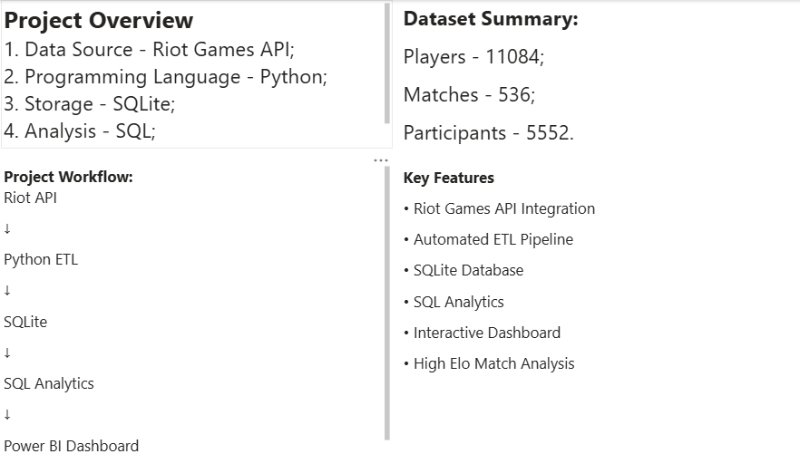

# 🧠 League of Legends Analytics Dashboard

An end-to-end data analytics project that collects, processes, analyzes and visualizes high-elo League of Legends ranked data using the Riot Games API, Python, SQL, SQLite and Power BI.

---

# 📌 Project Overview

This project demonstrates a complete data analytics workflow:

- Extract data from Riot Games API
- Build an ETL pipeline in Python
- Store structured data in SQLite
- Analyze data using SQL
- Export datasets for Power BI
- Create interactive dashboards

The project was developed as a portfolio project to demonstrate practical Data Analytics and Business Intelligence skills.

---

# ⚙️ Tech Stack

- Python
- Pandas
- SQLite
- SQL
- Riot Games API
- Matplotlib
- Power BI
- Git & GitHub

---

# 🏗️ Project Architecture

```
Riot Games API
        │
        ▼
Python ETL
(etl/collector_etl.py)
        │
        ▼
SQLite Database
(database/lol.db)
        │
        ▼
SQL Analytics
(analysis/)
        │
        ▼
CSV Export
        │
        ▼
Power BI Dashboard
```

---

# 📊 Dashboard Pages

### Overview

- LP Distribution
- Top Champions
- Average Match Duration
- Win Rate Overview

### Champion Analytics

- Champion Win Rate
- Average KDA
- Games Played
- Win Rate vs Games Scatter Plot

### Match Insights

- Match Duration Analysis
- Match Outcome Statistics
- Champion Performance Overview

---

# 📦 Dataset

The project contains approximately:

- 10,000+ ranked players
- 400+ ranked matches
- 4,000+ participant records

Data source:

- Riot Games API
- EUW Ranked Solo Queue

---

# 📈 Key Features

- End-to-end ETL pipeline
- Riot Games API integration
- SQLite analytical database
- SQL aggregations
- Power BI dashboards
- Python visualizations
- Duplicate match filtering
- API rate limit handling

---

# 📁 Project Structure

```
src/
    api.py
    database.py
    transform.py

etl/
    collector.py
    collector_etl.py
    collector_test.py

analysis/
    analysis.py
    export_csv.py
    export_dashboard.py

visualization/
    visualization.py

tests/
    check_db.py
    test_api.py

data/
database/
reports/

README.md
requirements.txt
```

---

# 🚀 How to Run

Install dependencies:

```bash
pip install -r requirements.txt
```

Collect data:

```bash
python etl/collector_etl.py
```

Generate SQL analysis:

```bash
python analysis/analysis.py
```

Export data for Power BI:

```bash
python analysis/export_dashboard.py
```

Create Python visualizations:

```bash
python visualization/visualization.py
```

---

# 📷 Dashboard Preview

## Overview Dashboard



---

## Champion Analytics



---

## Project Information



---

## The interactive Power BI dashboard is available in


# 💡 Business Value

This dashboard helps to:

- identify strong champions by win rate
- compare champion performance using KDA
- analyze ranked player distribution
- understand match duration trends
- support data-driven decision making

---

# 📌 Notes

- Data collected from Riot Games API
- Region: EUW
- Duplicate matches are removed
- SQLite is used as the analytical database
- API rate limits are handled using request delays

---

# 📄 License

This project was created for educational and portfolio purposes.

League of Legends data is provided by Riot Games API.